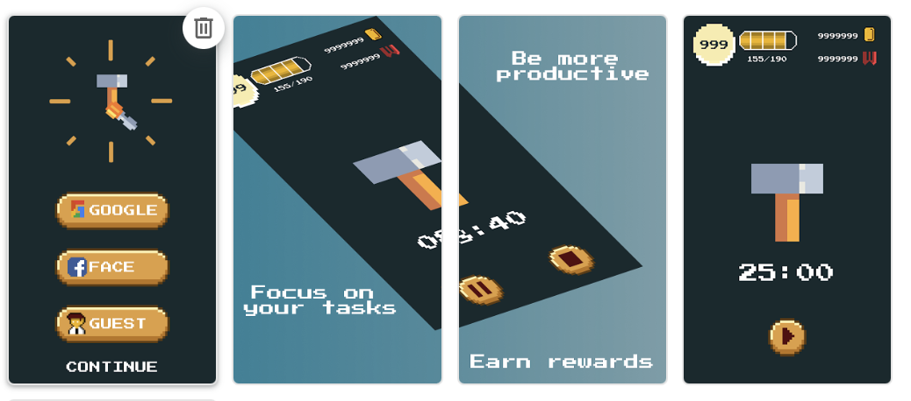
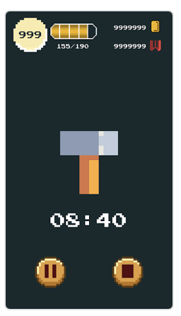

# Workaholic Pomodoro - Only Android

  
<br>
[](https://www.buymeacoffee.com/jonatascm)<br>

WorkaHolic Pomodoro is your a game made with Flutter to be more productive, using Pomodoro Technique® to get focus on your tasks, using 25 minutes of focusing and 5 minutes of break.

Win rewards after finishing the tasks and show to your teammates and friends who have more focusing in this game.

How to play:

1. Start the day by planning a 30 minutes tasks throughout the day.
2. Start the timer for each tasks.
3. Win rewards after finish your task

ps: Removed from stores

## UPDATE THOSE FILES:

```
android/app/src/main/AndroidManifest.xml
android/app/src/main/res/values/string.xml
replace add_your_google_services_here.json for your google_services.json
```

### After update app icon .png, run:

`flutter pub run flutter_launcher_icons:main`

### How to debug the app with wifi

1. Connect you phone with cable
2. Run `adb tcpip 5555`
3. Run `adb connect [mobile-ip]`
4. Start debuging the Driver App

ps: Command to get mobile ip: `adb shell ip -f inet addr show wlan0`

<div style="text-align:center"></div>
<div style="text-align:center"></div>
